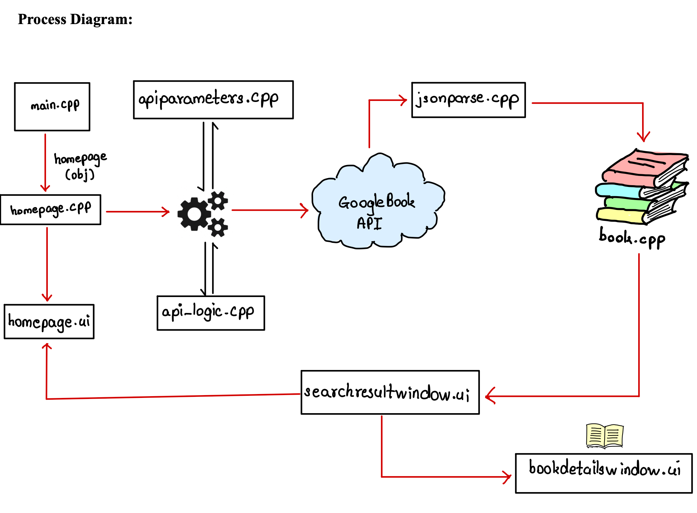
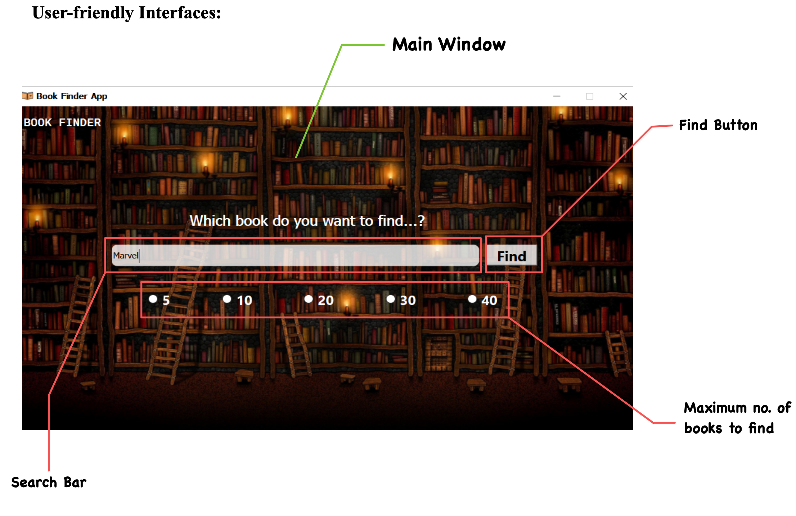
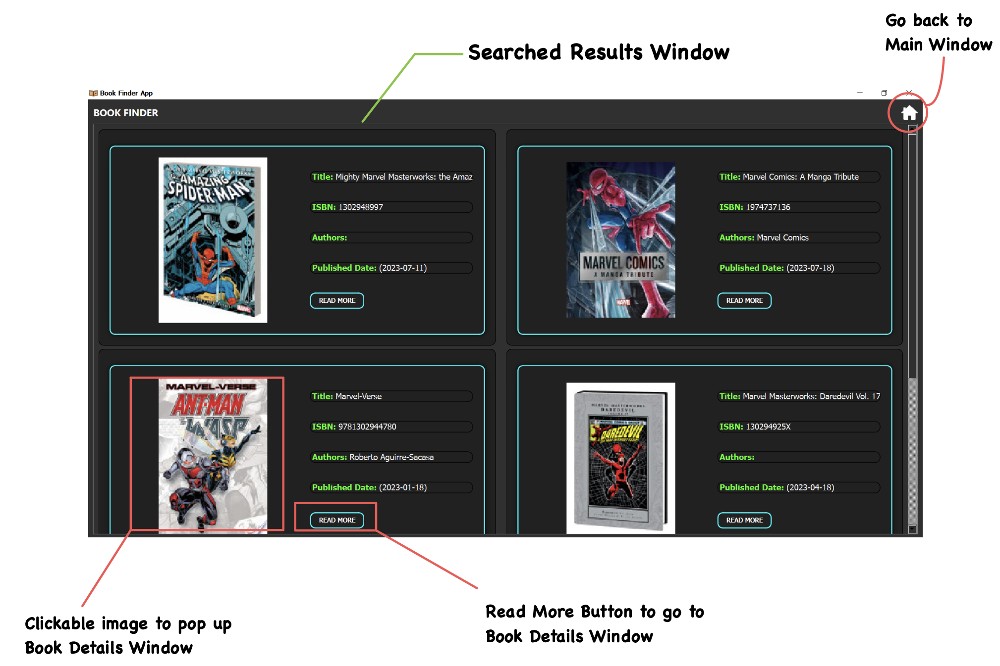
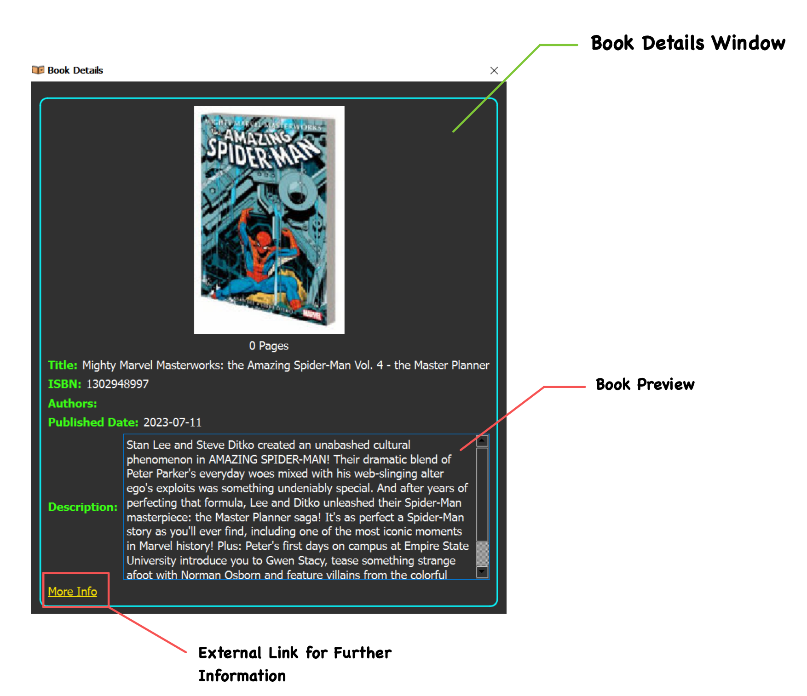
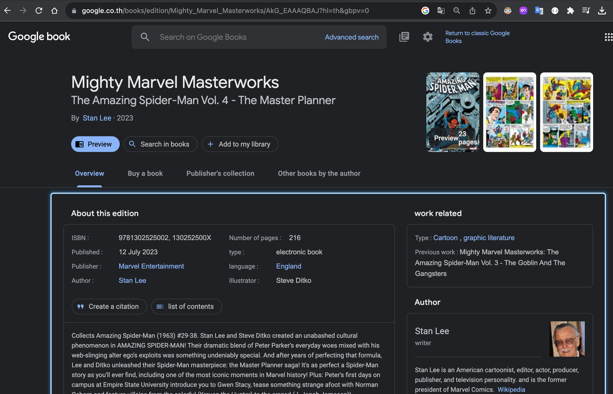

# BookQt Creator

An individual project for 01286131 Object-oriented Programming KMITL
Software Engineering Program, Year 1, Semester 2

If you want to see the details in pdf, here is [pdf file](/Final_Project_Report.pdf)

## Table of Contents

- [Introduction](#introduction)
- [Logic](#logic)
- [Class-Diagram](#class-diagram)
- [Features](#features)
     1. [Home-Page](#home-page)
     2. [Results-Page](#result-page)
     3. [Details](#detail)

## Introduction

The BookFinder App is a powerful tool that uses the Google Books API and C++ Qt Framework to allow users browse information about books by Query parameters such as limit, title, latest. 

This application aims to simplify the process of finding and exploring books by providing users with a seamless and intuitive search experience.

## Logic

## Class-Diagram

 

## Features

## 1.Home-Page

This is the main page a user will see in the app. He can choose options from "5" to "40" to generate a list of books.

After submitting any info he could find about the book, now the app will fetch connect to Google books api in the background and fetch the data about the book he wanted to find.

## 2.Results-Page

If he chose "5" option, he will now get 5 results of similar books from the info he provided.

He wanted to know more about a book from those results, he can click "Read More" button.

## 3.Details

This window will give some detailed information about the book, for eg. title, authors, ISBN, and description.

If he stills wants to know more about this book and needs more details, he can click "More info" button and he will be redirected with a link on browser for that book on Google Publisher website.

